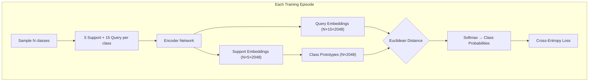
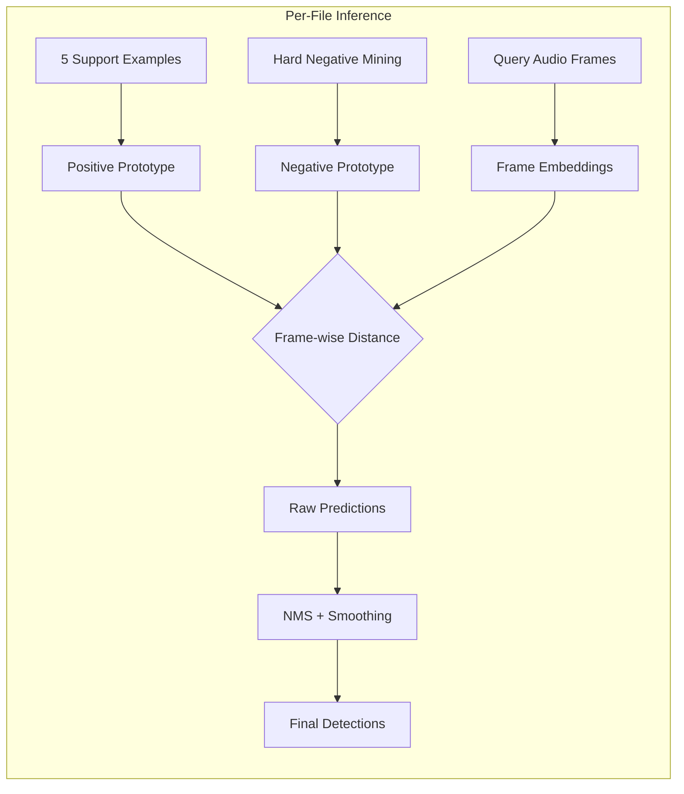

# DSAI Final Project: Few-Shot Bioacoustic Event Detection

> **DCASE 2024 Task 5** — Detecting animal vocalizations with only 5 examples per class.

This repository contains two complementary implementations for few-shot bioacoustic event detection, developed as part of the DSAI Final Project.

---

## Project Overview

| Codebase | Description | Key Features |
|:---------|:------------|:-------------|
| **[few-shot-bioacoustic-detection](few-shot-bioacoustic-detection/)** | Prototypical Network variants | ResNet, CBAM, BEATs, SE, Mamba encoders |
| **[logBase-Frame](logBase-Frame/)** | Production-quality FSBED | Pseudo-labeling adaptation, modular design |

---

## 1. Prototypical Network Framework

Located in `few-shot-bioacoustic-detection/`. This framework implements multiple encoder architectures for episodic few-shot learning.

### Quick Start

```bash
cd few-shot-bioacoustic-detection

# Create and activate virtual environment
python -m venv venv
source venv/bin/activate  # Linux/Mac
# venv\Scripts\activate   # Windows

# Install dependencies
pip install -r requirements.txt

# Train a model
python train.py model=protonet           # Baseline
python train.py model=protonet_v2        # CBAM Attention
python train.py model=protonet_v3        # BEATs Transformer
python train.py model=protonet_v4        # Squeeze-Excitation
python train.py model=protonet_mamba     # Mamba (SSM)

# Evaluate
python eval.py ckpt_path=checkpoints/best.ckpt
```

### Model Architectures

| Model | Encoder | Key Innovation | Parameters |
|:------|:--------|:---------------|:-----------|
| **Baseline** | ResNet-10 | Euclidean distance | 724K |
| **V2 (CBAM)** | ResNet + CBAM | Channel + Spatial attention | 728K |
| **V3 (BEATs)** | Transformer | AudioSet pre-training | 1.6M |
| **V4 (SE)** | ResNet + SE | Squeeze-Excitation blocks | 3.8M |
| **Mamba** | ResNet + Mamba | State Space Models (SSM) | 13.2M |

### How It Works

The system uses **Prototypical Networks** — a few-shot learning approach where classes are represented by the mean embedding (prototype) of their support examples.

#### Phase 1: Feature Extraction
```
Raw Audio (.wav) → STFT → Mel Filterbank → Log/PCEN → Spectrogram (T × 128)
```
- **Input:** Variable-length audio files (16kHz or 22kHz)
- **Output:** 2D time-frequency representations (128 mel bins)
- **Options:** Log-mel spectrograms or PCEN (Per-Channel Energy Normalization)

#### Phase 2: Episodic Training



- **Episodes:** Random sampling of classes and examples each iteration
- **Encoder:** CNN (ResNet/CBAM/SE) or Transformer (BEATs) or SSM (Mamba)
- **Prototype:** Mean of 5 support embeddings per class
- **Optimization:** Minimize distance to correct prototype

#### Phase 3: Inference & Evaluation



- **Positive Prototype:** Averaged embedding of 5 annotated support shots
- **Negative Prototype:** Dynamically estimated from background segments
- **Post-Processing:** Non-Maximum Suppression (IoU=0.7), temporal smoothing

---

## 2. LogBase-Frame (Production FSBED)

Located in `logBase-Frame/`. A production-quality, modular implementation with pseudo-labeling adaptation.

### Quick Start

```bash
cd logBase-Frame

# Activate virtual environment (shared or create new)
source /data/msc-proj/sppc18_venv/bin/activate  # Use shared venv
# OR create your own:
# python -m venv venv && source venv/bin/activate

# Install
pip install -r requirements.txt

# Train
python scripts/train.py --config configs/default.yaml

# Inference
python scripts/infer.py \
    --input_dir /path/to/audio \
    --checkpoint checkpoints/best.pt \
    --output predictions/

# Evaluate
python scripts/evaluate.py \
    --pred_dir predictions/ \
    --gt_dir /path/to/ground_truth
```

### Key Features

- **Pseudo-labeling Adaptation:** Iterative refinement (3 rounds) improves predictions.
- **Modular Design:** Separate modules for audio, data, models, adaptation, post-processing.
- **Production Ready:** Proper logging, configuration management, reproducibility seeds.

### Project Structure

```
logBase-Frame/
├── fsbed/                 # Core package
│   ├── audio/             # Audio processing (Mel, PCEN)
│   ├── models/            # Embedding networks
│   ├── adapt/             # Pseudo-labeling logic
│   └── postprocess/       # NMS, smoothing
├── scripts/               # CLI entry points
└── configs/               # YAML configurations
```

---

## Configuration

### ProtoNet Framework (`few-shot-bioacoustic-detection/configs/train.yaml`)

| Parameter | Description | Default |
|:----------|:------------|:--------|
| `train_param.num_episodes` | Episodes per epoch | 2000 |
| `train_param.n_shot` | Support examples | 5 |
| `train_param.k_way` | Classes per episode | 10 |
| `features.feature_types` | Input features | `pcen` |
| `features.embedding_dim` | Output dimension | 2048 |

### LogBase-Frame (`logBase-Frame/configs/default.yaml`)

| Parameter | Description | Default |
|:----------|:------------|:--------|
| `sample_rate` | Audio sample rate | 22050 |
| `n_mels` | Mel frequency bins | 128 |
| `embed_dim` | Embedding dimension | 256 |
| `n_support` | Support examples | 5 |
| `adapt_iterations` | Pseudo-label rounds | 3 |

---

## Data Paths

| Dataset | Path |
|:--------|:-----|
| Training Set | `/data/msc-proj/Training_Set` |
| Validation Set | `/data/msc-proj/Validation_Set_DSAI_2025_2026` |

---

## Results Summary

| Model | Precision | Recall | F-measure | Notes |
|:------|:----------|:-------|:----------|:------|
| Baseline | 57.1% | 38.7% | **46.1%** | Official DCASE baseline |
| V2 (CBAM) | 27.5% | 29.0% | **28.2%** | Attention improves localization |
| V3 (BEATs) | 12.8% | 14.1% | **13.4%** | Transfer learning from AudioSet |
| V4 (SE) | 26.8% | 24.3% | **25.5%** | Squeeze-Excitation (3.8M params) |
| Mamba | 9.1% | 19.0% | **12.3%** | Requires more training epochs |
| LogBase-Frame | — | — | — | Production pipeline |


---

## Project Structure

```
DSAI_Project/
├── few-shot-bioacoustic-detection/   # ProtoNet variants
│   ├── configs/                      # Hydra configs
│   ├── src/models/components/        # Encoder implementations
│   └── train.py                      # Training entry point
├── logBase-Frame/                    # Production FSBED
│   ├── fsbed/                        # Core package
│   └── scripts/                      # CLI tools
├── requirements.txt                  # Shared dependencies
└── README.md                         # This file
```

---

## References

- [DCASE 2024 Task 5](https://dcase.community/challenge2024/task-few-shot-bioacoustic-event-detection)
- [Original DCASE Baseline](https://github.com/c4dm/dcase-few-shot-bioacoustic)
- [Microsoft BEATs](https://github.com/microsoft/unilm/tree/master/beats)
- [Mamba: Linear-Time Sequence Modeling](https://github.com/state-spaces/mamba)

---

## License

MIT
